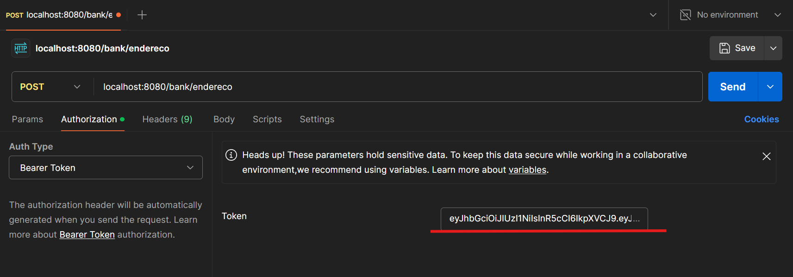

# Bank API

## Descrição

Trata-se de uma API Rest que simula o funcionamento básico de um banco digital, sendo possível criar conta, fazer login, cadastrar chaves pix, realizar transferências entre contas, tirar extrato bancário, entre outras funcionalidades.

Essa aplicação foi desenvolvida com Java 17, Spring Boot e Spring Security.Como banco de dados foi utilizado o MySQL. Além disso, utilizei serviços externos como o SMTP do Gmail para envio de e-mails e o serviço de CEP da ViaCEP para busca de endereços.

O principal motivo da criação desse serviço foi a necessidade de aprimorar meus conhecimentos em Java, além de ser um projeto que me desafiou a desenvolver uma aplicação completa, desde a modelagem do banco de dados até a documentação da API.

## Instrução de instalação

### Pré-requisitos
- Java 17
- MySQL
- Postman
- Chave do gmail para aplicações externas
- Arquivo application.properties com as seguintes propriedades:
```
api.security.token.secret=${JWT_SECRET:sua-chave-secreta}

spring.jpa.hibernate.ddl-auto=update
spring.datasource.url=jdbc:mysql://localhost:3306/Bank
spring.datasource.username=__altere-para-seu-usuario-do-mysql__
spring.datasource.password=sua-senha-do-mysql
spring.datasource.driver-class-name=com.mysql.cj.jdbc.Driver
spring.jpa.show-sql: true

spring.mail.host=smtp.gmail.com
spring.mail.port=587
spring.mail.username=seu-gmail
spring.mail.password=sua-chave-de-aplicativo-do-gmail
spring.mail.properties.mail.smtp.auth=true
spring.mail.properties.mail.smtp.starttls.enable=true
```
### Etapas:

1. Clone o repositório por meio do terminal com o comando abaixo :
```ddd
git clone https://github.com/kenedygondim/bank-api.git
```
2. Abra o projeto em sua IDE de preferência
3. Entre no arquivo pom.xml e recarregue as dependências do Maven
4. Crie o arquivo application.properties no caminho 
``` 
bank\src\main\resources
```
5. Adicione as propriedades citadas nos pré-requisitos com as informações do seu banco de dados e do seu gmail.
7. Execute a aplicação
---
## Instruções de uso

A api possui endpoints que podem ser acessados por usuários comuns, administradores e pelo público geral.

Para acessar os endpoints com permissão de administrador ou usuário, é necessário enviar o token de autenticação (Após realizar o login) no cabeçalho da requisição.
E como podemos fazer isso por meio do Postman?

Adicione método HTTP desejado, o endpoint e clique na aba Authorization. Selecione Bearer Token e cole o token recebido no login, conforme imagem abaixo:



Lembrando que esse processo deve ser feito em todas as requisições que necessitam do usuário/administrados estar autenticado.


### Público geral

Qualquer pessoa pode enviar requisições para os relacionados a solicitação de conta e login.

***

#### 1 - Solicitação de conta:

- Método HTTP: POST.
- Endpoint:
```
localhost:8080/bank/solicitarConta
```
- Corpo da requisição:
```json
{
    "primeiroNome" : "",
    "sobrenome" : "",
    "cpf": "",
    "dataNascimento": "",
    "email":"",
    "numeroTelefone": "",
    "senha": ""
}
```
*** 

#### 2 - Login:

Em caso de aprovação do cadastro, o usuário pode fazer login com o cpf e senha cadastrada.
- Método HTTP: POST.
- Endpoint:
```
localhost:8080/bank/auth/login
```
- Corpo da requisição:
```json
{
    "login": "",
    "senha": ""
}
```
Ao realizar o login, o usuário receberá um token de autenticação que deve ser enviado no cabeçalho das próximas requisições.
 
### Usuários cadastrados no sistema 

Os usuários cadastrados no sistema são os usuários que já realizaram o cadastro inicial e tiveram seus dados aprovados pelos admnistradores.

***
#### 3 - Cadastro de endereço:
- Método HTTP: POST.
- Endpoint:
```
localhost:8080/bank/endereco
```
- Corpo da requisição:
```json
{
    "cep": "",
    "casa": "",
    "complemento": ""
}
```
___Obs: O campo de complemento é opcional.___
*** 
#### 4 - Cadastro de senha para transações:

O usuário deve cadastrar uma senha para realizar transferências.

- Método HTTP: POST.
- Endpoint:
```
localhost:8080/bank/senhaTransacao
```
- Corpo da requisição:
```json
{
    "senha": "",
    "confirmacaoSenha": ""
}
```
*** 

#### 5 - Cadastro de chaves PIX:

O usuário pode cadastrar chaves PIX para receber transferências de outros usuários.

- Método HTTP: POST.
- Endpoint:
```
localhost:8080/bank/chavesPix
```
- Corpo da requisição:
```json
{
    "tipoChave": ""
}
```
Escolha entre as opções CPF,EMAIL,NUMERO_TELEFONE ou ALEATORIA. As chaves aleatórias são geradas automaticamente pelo sistema e as demais de acordo com as informações do usuário.

*** 

#### 6 - Realizar transferência:
- Método HTTP: POST.
- Endpoint:
```
localhost:8080/bank/transferencias
```
- Corpo da requisição:
```json
{
    "chavePix": "",
    "valor": 0.0
}
```
***
Continua...